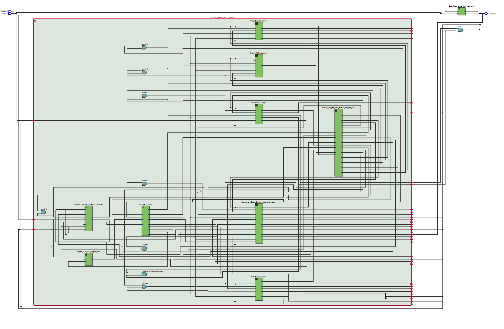
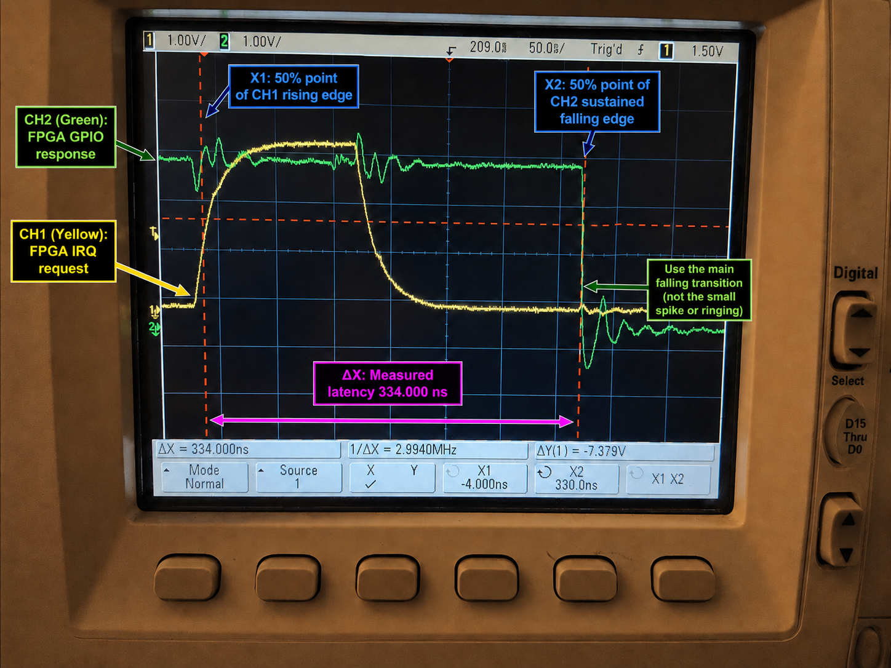
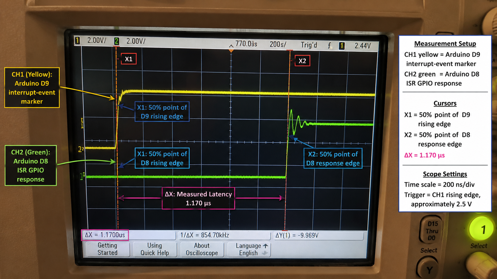
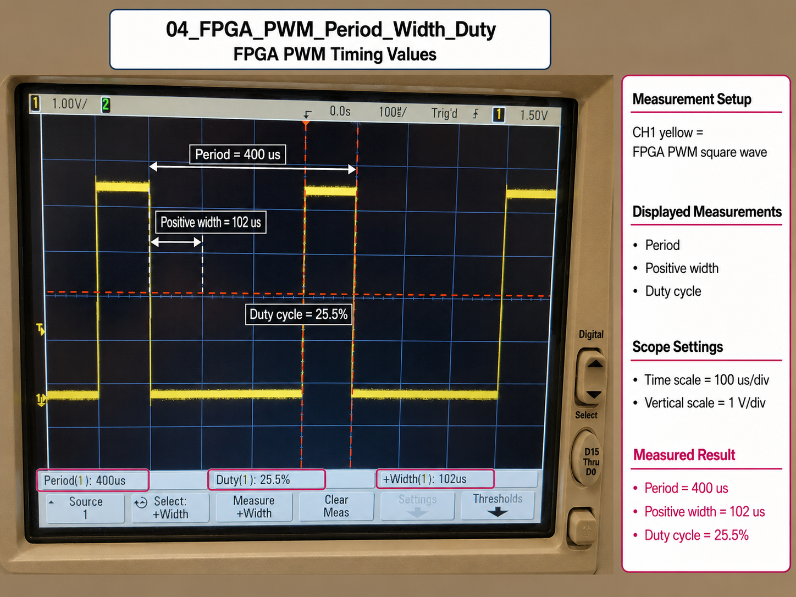

# FPGA MCU32 - AVR-Class Microcontroller on a DE10-Lite

A custom **32-bit fixed-cycle soft microcontroller implemented in VHDL** on an Intel MAX 10 FPGA. The design integrates a multi-cycle CPU, program/data memory, a memory-mapped bus, GPIO, timer, hardware PWM, prioritized interrupts, and dedicated timing/debug instrumentation.

**Capstone project - University of Windsor, Electrical & Computer Engineering (2026)**  
**Team:** Kazi Masrur Rahman and Yu Ching Tsao  
**Target hardware:** Terasic DE10-Lite / Intel MAX 10 (`10M50DAF484C7G`)

> The project uses an Arduino/ATmega328P-class board as a timing comparison baseline. “AVR-class” describes the embedded-control use case and comparison target; the custom MCU is not AVR instruction-set compatible.

## Project Highlights

- Designed a **32-bit multi-cycle CPU** with 16 general-purpose 32-bit registers and fixed 32-bit instructions.
- Built separate **1024 x 32-bit program ROM and data RAM** with a 32-bit memory-mapped interconnect.
- Implemented **GPIO, 32-bit timer, PWM, interrupt controller, and measurement/debug peripherals** in VHDL.
- Added self-checking verification across **18 VHDL testbenches**, from individual units through integrated CPU/peripheral behavior.
- Closed timing at **50 MHz** on the DE10-Lite with positive setup and hold slack.
- Measured an **FPGA request-to-GPIO response of 334 ns** using oscilloscope edge-crossing measurements.
- Demonstrated hardware PWM at **2.500 kHz and 25% duty cycle** using a 20,000-count period and 5,000-count duty setting.
- Exposed interrupt request, acknowledgement, ISR entry, PWM, and GPIO response through dedicated debug signals for Signal Tap and oscilloscope validation.

## Architecture

The system uses a Harvard-style memory organization and a common 32-bit memory-mapped peripheral bus.

| Block | Implementation |
|---|---|
| CPU | 32-bit multi-cycle FSM core |
| Register file | 16 x 32-bit registers |
| Instruction format | Fixed 32-bit |
| Program memory | 1024 x 32-bit ROM |
| Data memory | 1024 x 32-bit RAM |
| Bus | 32-bit memory-mapped interconnect |
| Peripherals | GPIO, timer, PWM, interrupt controller, measurement/debug |
| Clock | 50 MHz |
| FPGA | Intel MAX 10 on DE10-Lite |



## Memory Map

| Address range | Target |
|---|---|
| `0x00000000 - 0x00000FFF` | Data RAM |
| `0x40000000 - 0x4000001F` | GPIO |
| `0x40000020 - 0x4000003F` | Timer |
| `0x40000040 - 0x4000005F` | PWM |
| `0x40000060 - 0x4000007F` | Interrupt controller |
| `0x40000080 - 0x4000009F` | Measurement/debug |

Unmapped or invalid reads return `0xDEADBEEF` as a recognizable bus diagnostic value.

## Measured Results

### Interrupt response

The FPGA timing path was instrumented so the request and resulting GPIO response could be observed directly.



Measured request-to-GPIO response: **334 ns**.

For the Arduino Nano-class comparison, the corresponding marker-to-ISR GPIO response capture measured **1.170 us** under the defined experiment endpoints.



The measurements use different internal visibility because the FPGA exposes controller-level events that are not externally accessible on the commercial MCU; the comparison is therefore presented as an experimental timing baseline rather than a universal platform-performance claim.

### PWM

The hardware PWM counter operates independently of CPU instruction execution. With a 50 MHz clock, `PERIOD = 20000` and `DUTY = 5000` produce a nominal 400 us period, 100 us high time, **2.500 kHz**, and **25% duty cycle**.



## Verification

Verification was performed progressively:

1. Unit-level self-checking VHDL testbenches for the ALU, register file, memories, bus logic, GPIO, timer, PWM, interrupt controller, and measurement block.
2. CPU + memory and CPU + peripheral integration tests.
3. Full interrupt/ISR and firmware-driven system simulations.
4. Quartus synthesis, fitting, and static timing analysis at 50 MHz.
5. DE10-Lite LED-based hardware tests.
6. Intel Signal Tap observation of internal timing events.
7. Oscilloscope validation of interrupt response and PWM timing.

See [`docs/verification.md`](docs/verification.md) for the testbench inventory and validation flow.

## My Documented Contributions - Kazi Masrur Rahman

This was a two-person capstone project. My documented technical contributions included:

- Memory organization and the memory-mapped bus architecture.
- GPIO, timer, and PWM peripheral design/integration.
- Program/data memory integration and demonstration firmware configuration.
- DE10-Lite top-level integration, board I/O mapping, debug/probe outputs, and timing constraints.
- Shared work on interrupt/measurement integration and system-level validation.
- FPGA resource/timing analysis and laboratory measurement of interrupt/PWM behavior.
- Technical documentation and presentation of the implemented architecture and measured results.

The CPU core and other project elements were developed collaboratively with my teammate; this repository is presented as a portfolio record of the team project rather than as a claim of sole authorship.

## Repository Structure

```text
fpga-mcu32/
├── src/                  # Synthesizable VHDL
│   ├── bus/
│   ├── common/
│   ├── cpu/
│   ├── debug/
│   ├── memory/
│   ├── peripherals/
│   └── top/
├── testbench/            # Self-checking VHDL testbenches
├── quartus/              # Quartus project + timing constraints
├── debug/                # Signal Tap configurations
├── docs/                 # Architecture, verification, images, poster
└── scripts/              # Simulation helper
```

## Build in Quartus Prime

The original project was developed with **Quartus Prime 25.1 Standard**.

1. Clone the repository.
2. Open `quartus/MCU32_Project.qpf` in Quartus Prime.
3. Select the `top_level_de10_lite` revision if required.
4. Run **Analysis & Synthesis** or **Start Compilation**.
5. Program the DE10-Lite using the generated programming file.

The QSF references the VHDL source tree using paths relative to the `quartus/` directory, so the repository structure should be kept intact.

## Simulating with Questa / ModelSim

From the repository root, start Questa/ModelSim and run:

```tcl
do scripts/questa_compile.do
vsim work.tb_alu32
run -all
```

Replace `tb_alu32` with another entity from the `testbench/` directory. Integrated testbenches are listed in [`docs/verification.md`](docs/verification.md).

## Documentation

- [Architecture notes](docs/architecture.md)
- [Verification and validation](docs/verification.md)
- [Capstone poster](docs/poster/Team29_Poster.pdf)

## Tools & Skills Demonstrated

**VHDL · FPGA Design · Intel Quartus Prime · Questa/ModelSim · Digital Logic · Computer Architecture · Memory-Mapped I/O · Interrupts · PWM · Static Timing Analysis · Signal Tap · Oscilloscope Measurement · Hardware Verification**
## Contributors

- **Kazi Masrur Rahman** — FPGA integration, memory/bus system, GPIO, timer, PWM, hardware validation, timing analysis
- **Yu Ching Tsao** — CPU architecture, control unit, ALU, instruction implementation, verification
## License / Use

This repository is published for portfolio and technical-review purposes. See [`LICENSE`](LICENSE) before reusing project material.
